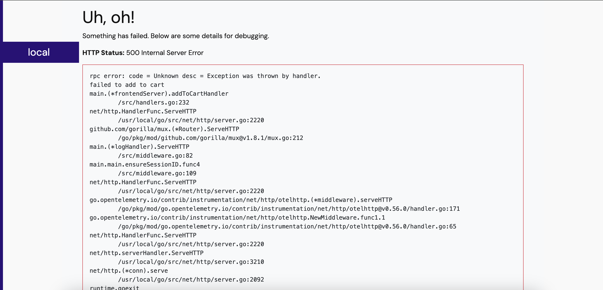

# Running Locally

1. Login to AWS with option 1.

2. Docker login:
```bash
aws ecr get-login-password --region eu-west-2 | docker login --username AWS --password-stdin 554043692091.dkr.ecr.eu-west-2.amazonaws.com
```

3. Bring up the app:
```bash
sudo docker-compose up   
```

4. Visit the page and try to add loafers. YOU CAN'T.
```bash
http://localhost:8080
```

