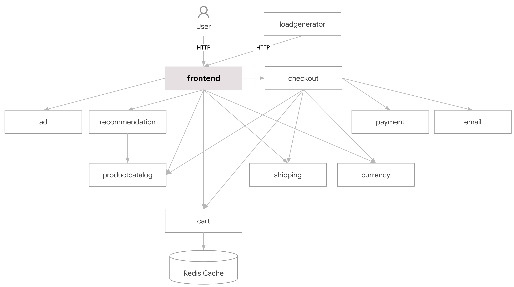

# Ballerina hackathon - KubeCon North America 2019

Ballerina hackathon is an open invitation to all the KubeCon NA 2019 attendees to use their Ballerina skills with Kubernetes to complete a series of coding challenges and win amazing prizes. 

- [Overview](#Overview)
- [Challenges](#Challenges)
- [Prizes](#Prizes)
- [Getting started](#Getting-started)
- [Submission guidelines](#Submission-guidelines) 
- [Judging](#Judging)
- [Rules](#Rules)
- [FAQ](#FAQ)
- [Hackathon policies](#Hackathon-policies)

## Overview
These coding challenges are all about having fun, learning a new programming language, mashing up microservices, and deploying them on Kubernetes. Here are some essential details about this hackathon. 

- Venue: KubeCon NA 2019

- Start: Nov 19, 2019 10.00AM

- End: Nov 21, 2019 12.00PM

- Winners will be announced by Nov 21, 209 3.00 PM

## Challenges
The challenges are based on the [Hipster Shop: Cloud-Native Microservices Demo Application](https://github.com/GoogleCloudPlatform/microservices-demo) developed by Google Cloud. It is a web-based e-commerce application with 10 microservices written in different programming languages that talk to each other over gRPC. You can refer to the original [README.md](https://github.com/GoogleCloudPlatform/microservices-demo/blob/master/README.md) file to learn more about this application. Here is a brief overview of the service architecture.

[](./docs/img/architecture-diagram.png)

In this hackathon, your task is to implement the following microservices in Ballerina. We calculated the level of difficulty based on the Ballerina knowledge required as well as the LOC. 

| Service                                              | Level of Difficulty |Language      | Description                                                                                                                       |
| ---------------------------------------------------- | ------------------- |------------- | --------------------------------------------------------------------------------------------------------------------------------- |
| [currencyservice](./src/currencyservice)             | Easy                | Node.js       | Converts one money amount to another currency. Uses real values fetched from European Central Bank. It's the highest QPS service. |
| [productcatalogservice](./src/productcatalogservice) | Easy                | Go            | Provides the list of products from a JSON file and ability to search products and get individual products.|
| [adservice](./src/adservice)                         | Easy                | Java          | Provides text ads based on given context words.|
| [cartservice](./src/cartservice)                     | Eedium              | C#            | Stores the items in the user's cart and retrieves it.|
| [checkoutservice](./src/checkoutservice)             | Hard                | C#            | Retrieves user cart, prepares order and orchestrates the payment, shipping and the email notification.|

### Implementation Instructions
We expect you to go through the instructions for each service before implementing the logic. You can refer to the original source code for more information.

| Service                                              | Instructions                                                                                                                       |
| ---------------------------------------------------- | --------------------------------------------------------------------------- |
| [currencyservice](./src/currencyservice)             | <ol><li>Read the conversion data in /src/currencyservice/data/currency_conversion.json (you can copy it to your ballerina project)</li><li>Then implement the logic to output the correct conversion based on the ratios in JSON data.</li><li>The `GetSupportedCurrencies` and `Convert` resources have to be implemented.</li></ol> |
| [productcatalogservice](./src/productcatalogservice) | <ol><li>Read the product.json using IO operations. Convert the JSON[] in to Product record[].</li><li>Then implement  ‘ListProducts’, ‘GetProduct’, and ‘SearchProducts’ resources.</li></ol> |
| [adservice](./src/adservice)                         | <ol><li>Implement service to generate ads based on given context keys.</li></ol> |
| [cartservice](./src/cartservice)                     | <ol><li>Implement the logic to update the user’s cart (add/remove) items or retrieve the cart.</li><li> Instead of the Redis store in the original implementation, you can use a `map<Cart>` as an in-memory store for the Ballerina implementation.</li></ol> |
| [checkoutservice](./src/checkoutservice)             | <ol><li>This microservice is a service chaining example where you need to integrate with services, including payment, email, shipping, currency, cart, and product catalog services.</ol> |
                                                                                                                
Read the product.json using IO operations. Convert the JSON[] in to Product record[].
Then implement  ‘ListProducts’, ‘GetProduct’, and ‘SearchProducts’ resources.

## Prizes
There are 5 challenges in this Ballerina hackathon. You need to complete all 5 challenges to be eligible for a prize.

- First Prize -  [Bose Quiet Comfort 35 wireless headphones II
  Star Wars: The Rise of Skywalker Edition](https://www.bose.com/en_us/products/headphones/over_ear_headphones/quietcomfort-35-wireless-ii-skywalker.html)

- Second Prize - [Echo Studio](https://www.amazon.com/Echo-Studio/dp/B07G9Y3ZMC)

- The next best 10 submissions will receive $50 worth Amazon vouchers. 


**[TODO]** Document eligibility criteria 


## Getting started
### Prerequisites
#### Ballerina 
- Visit https://ballerina.io/downloads/ to install the latest ballerina version 1.0.4 as well as the VSCode or IntelliJ IDEA plugins. 

#### Docker and Kubernetes 
- Use Docker for Mac to install on Mac.
- Use Docker for Windows to install on Windows.
- Use Minikube to install on Linux.

### GitHub repository
1. Create a private GitHub repository in your account. Do not fork this repository if you want to keep your code private during the hackathon. An example repository name would be `ballerina-hackathon-kubecon-na-19`
1. Run following commands to merge microservices-demo content to your newly created repository.
    ```bash
    $ git clone https://github.com/<gitbubusername>/ballerina-hackathon-kubecon-na-19

    $ cd ballerina-hackathon-kubecon-na-19

    $ git remote add upstream https://github.com/ballerina-guides/microservices-demo.git

    $ git pull upstream master

    $ git push origin master
    ```

### Running Hipster Shop Application (unchanged)
1. Run the following command to deploy the app. This will take ~10 mins to complete. You will use pre-built container images that are available publicly, instead of building them yourself, which takes a long time
    ```sh
    kubectl apply -f ./release/kubernetes-manifests.yaml
    ```
2. Run `kubectl get pods` to see pods are in a Ready state. 
3. If all the pods are running, `kubectl get service/frontend-external`
4. Find the IP address of your application, then visit the application on your browser to confirm installation. (http://localhost:80 )
    ```sh
    kubectl get service/frontend-external
    ```
    Note: If you are on minikube, get the hostname by executing `minikube ip`. Example: <MINIKUBE_IP>:<FRONTEND_EXTERNAL_PORT>

    You have successfully installed the default application by now. 
5. Run `kubectl delete -f ./release/kubernetes-manifests.yaml` to delete what's deployed.

### Running Hipster Shop Application with Ballerina services
We’ve already implemented the recommendation service in Ballerina, and the source code is available in `src/recommendatationservice_ballerina` directory.
1. Run the `scripts/setup.sh` script.

2. Check pods with `kubectl get pods`

3. Access the web UI (http://localhost:80 or `http://<minikube_ip>:<port>`)

4. Run the `scripts/shutdown.sh` script to delete what's deployed.

### Let's start with Currency Service
Now that you’ve successfully installed and deployed the Hipster Shop application with one microservice written in Ballerina, it is time to start working on the challenges. Let’s start with writing the [currencyservice](./src/currencyservice) in Ballerina. You can repeat the following set of instructions for all five services.  

[TODO]

## Submission guidelines

Once you complete all 5 challenges, you can submit the source code and other details via the following mechanism. 

- Document everything that we need to be aware of your solution in the root README.md file of your repository. 
- Download a zip file of your GitHub repository using the GitHub web interface. 
- Then follow the instructions given in this Google form. **[TODO]**


## Judging
A panel of judges will review each successful submission based on the following criteria. 

**[TODO]**

## Rules
- You have to be a KubeCon North America 2019 attendee to participate in this hackathon.
- **[TODO]**


## FAQ
1. How do I get help with queries related to the hackathon?

    If you have general questions on Ballerina, ask them on our Slack channel, Google group, or on Stackoverflow with the tag [ballerina]. If you have specific questions related to the hackathon, please visit the Ballerina booth(P13).

2. Is this an individual challenge, or can I form a team for this?

    [TODO]
3. Who can participate in the hackathon?

    You have to be a KubeCon North America 2019 attendee to participate in this hackathon.

4. **[TODO]**


## Hackathon policies?

**[TODO]**
