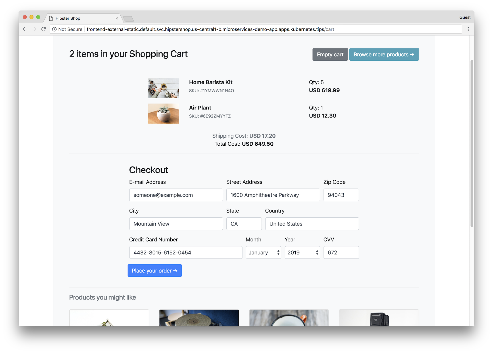

# Hipster Shop: Cloud-Native Microservices Demo Application

This project contains a 10-tier microservices application. The application is a
web-based e-commerce app called **“Hipster Shop”** where users can browse items,
add them to the cart, and purchase them.

**Google uses this application to demonstrate Kubernetes, GKE, Istio,
Stackdriver, gRPC** and similar cloud-native technologies nowadays.

## Screenshots

| Home Page | Checkout Screen |
|-----------|-----------------|
|  |  |

## Service Architecture

**Hipster Shop** is composed of many microservices written in different
languages that talk to each other over gRPC.

Find **Protocol Buffers Descriptions** at the [`./pb` directory](./pb).

| Service | Language | Description |
|---------|----------|-------------|
| [frontend](./src/frontend) | Go | Exposes an HTTP server to serve the website. Does not require signup/login and generates session IDs for all users automatically. |
| [cartservice](./src/cartservice) |  C# | Stores the items in the user's shipping cart in Redis and retrieves it. |
| [productcatalogservice](./src/productcatalogservice) | Go | Provides the list of products from a JSON file and ability to search products and get individual products. |
| [currencyservice](./src/currencyservice) | Node.js | Converts one money amount to another currency.  Uses real values fetched from European Central Bank. It's the highest QPS service. |
| [paymentservice](./src/paymentservice) | Node.js | Charges the given credit card info (hypothetically😇) with the given amount and returns a transaction ID. |
| [shippingservice](./src/shippingservice) | Go | Gives shipping cost estimates based on the shopping cart. Ships items to the given address (hypothetically😇) |
| [emailservice](./src/emailservice) | Python | Sends users an order confirmation email (hypothetically😇). |
| [checkoutservice](./src/checkoutservice) | Go | Retrieves user cart, prepares order and orchestrates the payment, shipping and the email notification. |
| [recommendationservice](./src/recommendationservice) | Python | Recommends other products based on what's given in the cart. |
| [adservice](./src/adservice) | Java | Provides text ads based on given context words. |
| [loadgenerator](./src/loadgenerator) | Python/Locust | Continuously sends requests imitating realistic user shopping flows to the frontend. |

## Features

- **[Kubernetes](https://kubernetes.io)/[GKE](https://cloud.google.com/kubernetes-engine/):**
  The app is designed to run on Kubernetes (both locally on "Docker for
  Desktop", as well as on the cloud with GKE).
- **[gRPC](https://grpc.io):** Microservices use a high volume of gRPC calls to
  communicate to each other.
- **[Istio](https://istio.io):** Application works on Istio service mesh.
- **[OpenCensus](https://opencensus.io/) Tracing:** Most services are
  instrumented using OpenCensus trace interceptors for gRPC/HTTP.
- **[Stackdriver APM](https://cloud.google.com/stackdriver/):** Many services
  are instrumented with **Profiling**, **Tracing** and **Debugging**. In
  addition to these, using Istio enables features like Request/Response
  **Metrics** and **Context Graph** out of the box. When it is running out of
  Google Cloud, this code path remains inactive.
- **[Skaffold](https://github.com/GoogleContainerTools/skaffold):** Application
  is deployed to Kubernetes with a single command using Skaffold.
- **Synthetic Load Generation:** The application demo comes with a background
  job that creates realistic usage patterns on the website using
  [Locust](https://locust.io/) load generator.

## Installation

> **Note:** that the first build can take up to 20-30 minutes. Consequent builds
> will be faster.

### Option 1: Running locally with “Docker for Desktop”

> 💡 Recommended if you're planning to develop the application.

1. Install tools to run a Kubernetes cluster locally:

   - kubectl (can be installed via `gcloud components install kubectl`)
   - Docker for Desktop (Mac/Windows): It provides Kubernetes support as [noted
     here](https://docs.docker.com/docker-for-mac/kubernetes/).
   - [skaffold](https://github.com/GoogleContainerTools/skaffold/#installation)

1. Launch “Docker for Desktop”. Go to Preferences and choose “Enable Kubernetes”.

1. Run `kubectl get nodes` to verify you're connected to “Kubernetes on Docker”.

1. Run `skaffold run` (first time will be slow, it can take ~20-30 minutes).
   This will build and deploy the application. If you need to rebuild the images
   automatically as you refactor he code, run `skaffold dev` command.

1. Run `kubectl get pods` to verify the Pods are ready and running. The
   application frontend should be available at http://localhost:80 on your
   machine.

### Option 2: Running on Google Kubernetes Engine (GKE)

> 💡  Recommended for demos and making it available publicly.

1. Install tools specified in the previous section (Docker, kubectl, skaffold)

1. Create a Google Kubernetes Engine cluster and make sure `kubectl` is pointing
   to the cluster.

        gcloud services enable container.googleapis.com

        gcloud container clusters create demo --enable-autoupgrade \
            --enable-autoscaling --min-nodes=3 --max-nodes=10 --num-nodes=5 --zone=us-central1-a

        kubectl get nodes

1. Enable Google Container Registry (GCR) on your GCP project and configure the
   `docker` CLI to authenticate to GCR:

       gcloud services enable containerregistry.googleapis.com

       gcloud auth configure-docker -q

1. In the root of this repository, run `skaffold run --default-repo=gcr.io/[PROJECT_ID]`,
   where [PROJECT_ID] is your GCP project ID.
   
   This command:
   - builds the container images
   - pushes them to GCR
   - applies the `./kubernetes-manifests` deploying the application to
     Kubernetes.

   **Troubleshooting:** If you get "No space left on device" error on Google Cloud Shell,
   you can build the images on Google Cloud Build:
   [Enable the Cloud Build API](https://console.cloud.google.com/flows/enableapi?apiid=cloudbuild.googleapis.com), then run `skaffold run -p gcb  --default-repo=gcr.io/[PROJECT_ID]` instead.

1.  Find the IP address of your application, then visit the application on your
    browser to confirm installation.

        kubectl get service frontend-external

    **Troubleshooting:** A Kubernetes bug (will be fixed in 1.12) combined with
    a Skaffold [bug](https://github.com/GoogleContainerTools/skaffold/issues/887)
    causes load balancer to not to work even after getting an IP address. If you
    are seeing this, run `kubectl get service frontend-external -o=yaml | kubectl apply -f-`
    to trigger load balancer reconfiguration.

### (Optional) Deploying on a Istio-installed cluster

> **Note:** you followed GKE deployment steps above, run `skaffold delete` first
> to delete what's deployed.

1. Create a GKE cluster.

2. Install Istio **without mutual TLS** authentication option.

   > (Optional) If you'd like to enable mTLS in the demo app, you need to
   > make a few changes to the deployment manifests:
   >
   > - `kubernetes-manifests/frontend.yaml`: delete "livenessProbe" and
   >   "readinessProbe" fields.
   > - `kubernetes-manifests/loadgenerator.yaml`: delete "initContainers" field.

3. Install the automatic sidecar injection (annotate the `default` namespace
   with the label):

       kubectl label namespace default istio-injection=enabled

4. Apply the manifests in [`./istio-manifests`](./istio-manifests) directory.

       kubectl apply -f ./istio-manifests

    This is required only once.

5. Deploy the application with `skaffold run --default-repo=gcr.io/[PROJECT_ID]`.

6. Run `kubectl get pods` to see pods are in a healthy and ready state.

7. Find the IP address of your istio gateway Ingress or Service, and visit the
   application.

       INGRESS_HOST="$(kubectl -n istio-system get service istio-ingressgateway -o jsonpath='{.status.loadBalancer.ingress[0].ip}')"

       echo "$INGRESS_HOST"

       curl -v "http://$INGRESS_HOST"

---

**Note to fellow Googlers:** Please fill out the form at
[go/microservices-demo](http://go/microservices-demo) if you are using this
application.

This is not an official Google project.
