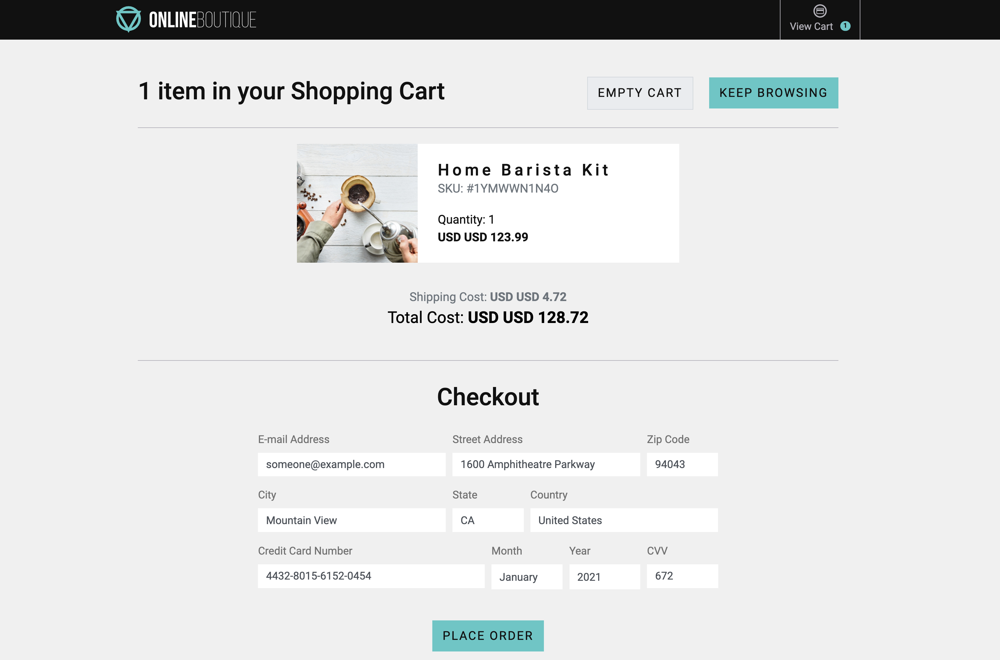

<p align="center">

</p>


**Online Boutique** is a cloud-native microservices demo application.
Online Boutique consists of a 10-tier microservices application. The application is a
web-based e-commerce app where users can browse items,
add them to the cart, and purchase them.

**Google uses this application to demonstrate use of technologies like
Kubernetes/GKE, Istio, Stackdriver, gRPC and OpenCensus**. This application
works on any Kubernetes cluster (such as a local one), as well as Google
Kubernetes Engine. It’s **easy to deploy with little to no configuration**.

If you’re using this demo, please **★Star** this repository to show your interest!

> 👓**Note to Googlers:** Please fill out the form at
> [go/microservices-demo](http://go/microservices-demo) if you are using this
> application.

Looking for the old Hipster Shop frontend interface? Use the [manifests](https://github.com/GoogleCloudPlatform/microservices-demo/tree/v0.1.5/kubernetes-manifests) in release [v0.1.5](https://github.com/GoogleCloudPlatform/microservices-demo/releases/v0.1.5).

## Screenshots

| Home Page                                                                                                         | Checkout Screen                                                                                                    |
| ----------------------------------------------------------------------------------------------------------------- | ------------------------------------------------------------------------------------------------------------------ |
| [](./docs/img/online-boutique-frontend-1.png) | [](./docs/img/online-boutique-frontend-2.png) |

## Service Architecture

**Online Boutique** is composed of many microservices written in different
languages that talk to each other over gRPC.

[](./docs/img/architecture-diagram.png)

Find **Protocol Buffers Descriptions** at the [`./pb` directory](./pb).

| Service                                              | Language      | Description                                                                                                                       |
| ---------------------------------------------------- | ------------- | --------------------------------------------------------------------------------------------------------------------------------- |
| [frontend](./src/frontend)                           | Go            | Exposes an HTTP server to serve the website. Does not require signup/login and generates session IDs for all users automatically. |
| [cartservice](./src/cartservice)                     | C#            | Stores the items in the user's shopping cart in Redis and retrieves it.                                                           |
| [productcatalogservice](./src/productcatalogservice) | Go            | Provides the list of products from a JSON file and ability to search products and get individual products.                        |
| [currencyservice](./src/currencyservice)             | Node.js       | Converts one money amount to another currency. Uses real values fetched from European Central Bank. It's the highest QPS service. |
| [paymentservice](./src/paymentservice)               | Node.js       | Charges the given credit card info (mock) with the given amount and returns a transaction ID.                                     |
| [shippingservice](./src/shippingservice)             | Go            | Gives shipping cost estimates based on the shopping cart. Ships items to the given address (mock)                                 |
| [emailservice](./src/emailservice)                   | Python        | Sends users an order confirmation email (mock).                                                                                   |
| [checkoutservice](./src/checkoutservice)             | Go            | Retrieves user cart, prepares order and orchestrates the payment, shipping and the email notification.                            |
| [recommendationservice](./src/recommendationservice) | Python        | Recommends other products based on what's given in the cart.                                                                      |
| [adservice](./src/adservice)                         | Java          | Provides text ads based on given context words.                                                                                   |
| [loadgenerator](./src/loadgenerator)                 | Python/Locust | Continuously sends requests imitating realistic user shopping flows to the frontend.                                              |

## Features

- **[Kubernetes](https://kubernetes.io)/[GKE](https://cloud.google.com/kubernetes-engine/):**
  The app is designed to run on Kubernetes (both locally on "Docker for
  Desktop", as well as on the cloud with GKE).
- **[gRPC](https://grpc.io):** Microservices use a high volume of gRPC calls to
  communicate to each other.
- **[Istio](https://istio.io):** Application works on Istio service mesh.
- **[OpenTelemetry](https://opentelemetry.io/) Tracing:** Most services are
  instrumented using OpenTelemetry trace interceptors for gRPC/HTTP.
- **[Skaffold](https://skaffold.dev):** Application
  is deployed to Kubernetes with a single command using Skaffold.
- **Synthetic Load Generation:** The application demo comes with a background
  job that creates realistic usage patterns on the website using
  [Locust](https://locust.io/) load generator.

## Quickstart

1. Make sure that you have access to a kubernetes cluster. It can be provisioned using 
   any cloud provider or you can setup a local cluster.

   There are three options to run a **Kubernetes cluster locally** for this demo:
    - [Minikube (recommended)](https://kubernetes.io/docs/setup/minikube/). 
      Please, ensure that the local Kubernetes cluster has at least  4 CPU's and 4.0 GiB of memory.
      ```shell
      minikube start --cpus=4 --memory 4096
      ```
      Also run `minikube tunnel` in a separate console to be able to access app's UI.
    - [Docker for Desktop](https://www.docker.com/products/docker-desktop)
      - set CPUs to at least 3, and Memory to at least 6.0 GiB
      - on the "Disk" tab, set at least 32 GB disk space.
    - [Kind](https://github.com/kubernetes-sigs/kind)
      ```shell
      kind create cluster
      ```

1. Create kubernetes manifest files:
   ```shell
   ./hack/make-release-artifacts.sh
   ```
   If you want to enable Splunk RUM instrumentation, set `RUM_REALM` and `RUM_AUTH` env variables 
   before creating the manifest files, for example
   ```shell
   export RUM_REALM=<YOUR_RUM_SPLUNK_REALM> RUM_AUTH=<YOUR_RUM_AUTH_TOKEN>
   ```
   Optional RUM parameters can be used as well: `RUM_APP_NAME`, `RUM_ENVIRONMENT` and `RUM_DEBUG`.

1. Now you can see kubernetes manifest in `./release/kubernetes-manifests.yaml`. To apply it in your 
   kubernetes cluster, run:
    ```shell
    kubectl apply -f release/kubernetes-manifests.yaml
    ```

1. Run `kubectl get pods` to verify the Pods are ready and running. It may take up to 2 minutes.

1. Now you can see web frontend by looking for `EXTERNAL_IP` of the frontend kubernetes service:
   ```shell
   kubectl get service frontend-external | awk '{print $4}'
   ```
   The same way you can access the load generator UI:
   ```shell
   kubectl get service loadgenerator | awk '{print $4}'
   ```

## Local development

1. Launch a local Kubernetes cluster with one of the following tools:

    - To launch **Minikube** (tested with Ubuntu Linux). Please, ensure that the
       local Kubernetes cluster has at least:
        - 4 CPUs
        - 4.0 GiB memory
        - 32 GB disk space

      ```shell
      minikube start --cpus=4 --memory 4096 --disk-size 32g
      ```

    - To launch **Docker for Desktop** (tested with Mac/Windows). Go to Preferences:
        - choose “Enable Kubernetes”,
        - set CPUs to at least 3, and Memory to at least 6.0 GiB
        - on the "Disk" tab, set at least 32 GB disk space

    - To launch a **Kind** cluster:

      ```shell
      kind create cluster
      ```

1. Run `kubectl get nodes` to verify you're connected to the respective control plane.

1. Run `skaffold run` (first time will be slow, it can take ~20 minutes).
   This will build and deploy the application. If you need to rebuild the images
   automatically as you refactor the code, run `skaffold dev` command.

1. Run `kubectl get pods` to verify that all the pods are ready and running.

1. Access the web frontend through your browser
    - **Minikube** requires you to run a command to access the frontend service:

    ```shell
    minikube service frontend-external
    ```

    - **Docker For Desktop** should automatically provide the frontend at http://localhost:80

    - **Kind** does not provision an IP address for the service.
      You must run a port-forwarding process to access the frontend at http://localhost:8080:

    ```shell
    kubectl port-forward deployment/frontend 8080:8080
    ```

## Cleanup

If you've deployed the application with `skaffold run` command, you can run
`skaffold delete` to clean up the deployed resources.

If you've deployed the application with `kubectl apply -f [...]`, you can
run `kubectl delete -f [...]` with the same argument to clean up the deployed
resources.

## Conferences featuring Online Boutique

- [Google Cloud Next'18 London – Keynote](https://youtu.be/nIq2pkNcfEI?t=3071)
  showing Stackdriver Incident Response Management
- Google Cloud Next'18 SF
  - [Day 1 Keynote](https://youtu.be/vJ9OaAqfxo4?t=2416) showing GKE On-Prem
  - [Day 3 – Keynote](https://youtu.be/JQPOPV_VH5w?t=815) showing Stackdriver
    APM (Tracing, Code Search, Profiler, Google Cloud Build)
  - [Introduction to Service Management with Istio](https://www.youtube.com/watch?v=wCJrdKdD6UM&feature=youtu.be&t=586)
- [KubeCon EU 2019 - Reinventing Networking: A Deep Dive into Istio's Multicluster Gateways - Steve Dake, Independent](https://youtu.be/-t2BfT59zJA?t=982)

---

This is not an official Google project.
