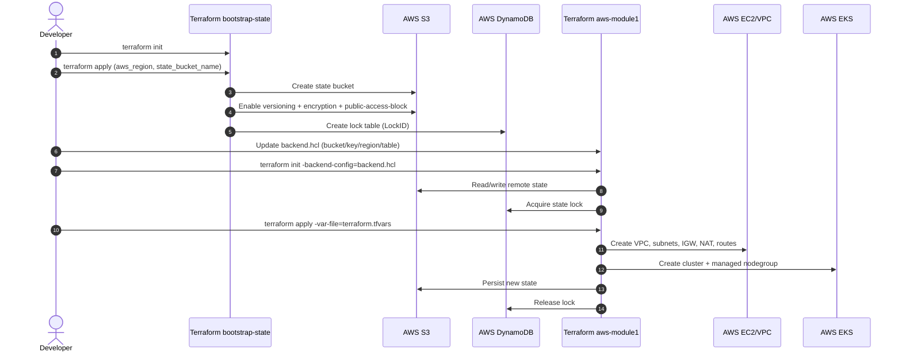
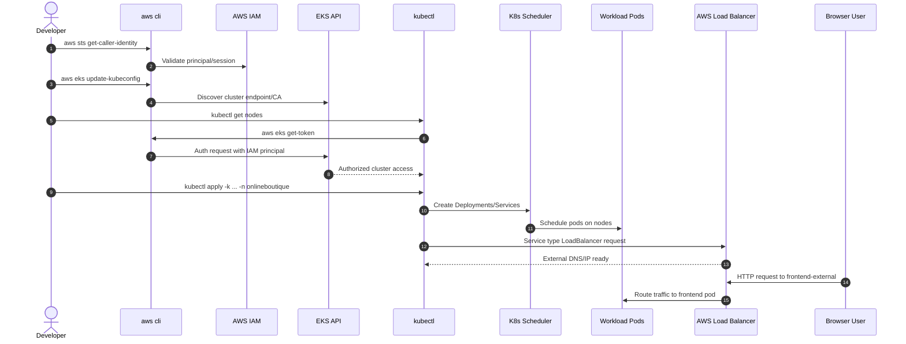
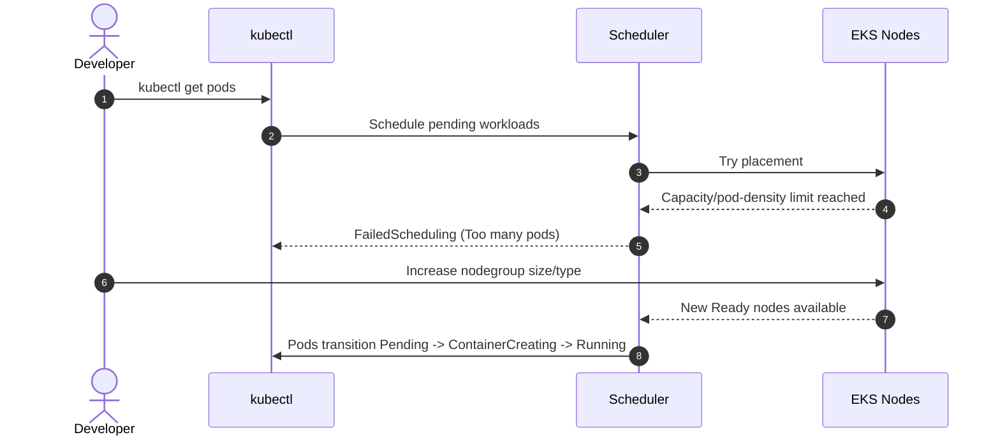

# Module 1 Tutorial: AWS Infrastructure Foundations (State + Network + EKS)

This document is a beginner-friendly, detailed tutorial for the first infrastructure part of the project.

Who this is for:
- You understand networking concepts (subnets, routing, NAT, gateways).
- You are new to AWS implementation details and Terraform workflows.

What this tutorial covers:
1. Core concepts you must understand first.
2. Which AWS services we use and why.
3. What we implemented in this repository so far.
4. Step-by-step deployment flow for this part.
5. Real issues we hit and how to fix them.
6. What is still pending before website deployment.

---

## 1. Big Picture

Goal of this module:
- Build a clean, reproducible AWS infrastructure base.
- Work safely as a team without state conflicts.
- Prepare EKS so the website can be deployed later.

Scope of this part:
- Terraform remote state foundation.
- VPC + public/private subnet architecture.
- NAT egress for private workloads.
- EKS cluster and managed node group.
- Optional Kubernetes bootstrap resources (namespaces/RBAC/Helm).

Not yet the final website delivery:
- This module prepares infra.
- Application deployment comes after infra validation.

---

## 2. Core Concepts (Before Commands)

### 2.1 Infrastructure as Code (IaC)

IaC means infrastructure is declared in code, versioned in Git, reviewed, and reproducible.

Why it matters:
- Repeatability: same infra in dev/stage/prod.
- Traceability: every infra change is in commit history.
- Collaboration: team uses same source of truth.

### 2.2 Terraform State

Terraform state is a data file that maps:
- What Terraform thinks exists.
- Which cloud resources correspond to each Terraform resource.

If state is local only:
- Team members can overwrite each other.
- Drift and conflicts become common.

### 2.3 Remote Backend (S3 + DynamoDB)

For team-safe Terraform on AWS:
- S3 stores the state file.
- DynamoDB stores lock metadata.

Locking behavior:
- During `terraform apply`, Terraform locks state.
- A second concurrent apply is blocked.

### 2.4 Why Two Terraform Stacks

You cannot cleanly create and consume the backend in the same first init sequence.

Terraform needs backend settings before it can run main operations.

So we use two stacks:
1. `bootstrap-state`: creates S3 + DynamoDB.
2. `aws-module1`: uses that backend to create main infra.

This is the standard bootstrap pattern.

### 2.5 Workspaces

Terraform workspaces separate state by environment (`dev`, `stage`, `prod`) while reusing same code.

Important:
- Workspaces do not replace good variable management.
- They are state isolation, not full environment policy.

### 2.6 Public vs Private Subnets + NAT

In this project:
- Public subnets: entry-related resources and NAT placement.
- Private subnets: EKS worker nodes run here.

Why NAT is required:
- Private nodes still need outbound internet for image pull, updates, package repos.
- NAT allows outbound traffic without exposing private nodes to inbound internet.

### 2.7 EKS Managed Node Group

Managed node group means AWS handles node lifecycle operations (replace, update patterns, etc.).

You still configure:
- Instance type(s).
- Min/desired/max size.

### 2.8 Helm, Namespaces, RBAC

After cluster creation:
- Helm installs platform components (`metrics-server`, `ingress-nginx`, `argocd`).
- Namespaces organize workloads by domain.
- RBAC controls who can read/write cluster resources.

---

## 3. Services Used and Why

### 3.1 Amazon S3

Used for remote Terraform state storage.

In our code we enable:
- Versioning.
- Server-side encryption.
- Public access blocking.

### 3.2 Amazon DynamoDB

Used as Terraform lock table.

In our code:
- Table name defaults to `blackfriday-terraform-locks-mah-groupe1`.
- Hash key is `LockID`.

### 3.3 Amazon VPC

Provides isolated network boundary.

In our code:
- CIDR defaults to `10.40.0.0/16`.
- 3 public + 3 private subnets across 3 AZ.

### 3.4 Internet Gateway

Attached to VPC to provide internet route for public subnet route table (`0.0.0.0/0`).

### 3.5 NAT Gateway + Elastic IP

NAT Gateway is deployed in first public subnet.

Private route table sends `0.0.0.0/0` to NAT.

### 3.6 Amazon EKS

Runs Kubernetes control plane + managed node groups.

In our module:
- Kubernetes version default `1.31`.
- Node group default type was `m6i.large` (later adjusted to `t3.micro` for free-tier mode constraints).

### 3.7 Helm and Kubernetes Provider

Used in phase 2 (`enable_cluster_bootstrap=true`) to install:
- Metrics Server.
- Ingress NGINX.
- Argo CD.

---

## 4. Repository Implementation Map

### 4.1 State Bootstrap Stack

Path: `terraform/aws-module1/bootstrap-state`

Main files:
- `versions.tf`: Terraform + AWS provider version constraints.
- `providers.tf`: AWS region provider config.
- `variables.tf`: `aws_region`, `state_bucket_name`, `lock_table_name`.
- `main.tf`: S3 bucket + security controls + DynamoDB lock table.
- `outputs.tf`: outputs for backend wiring.

### 4.2 Main Infra Stack

Path: `terraform/aws-module1`

Main files:
- `versions.tf`: providers + `backend "s3" {}`.
- `backend.hcl`: concrete backend values.
- `providers.tf`: AWS + EKS auth data + Kubernetes/Helm providers.
- `variables.tf`: VPC/EKS sizing and behavior flags.
- `main.tf`: VPC/EKS module calls + optional cluster bootstrap resources.
- `outputs.tf`: cluster/network outputs.

### 4.3 VPC Module

Path: `terraform/aws-module1/modules/vpc`

What it creates:
- VPC.
- Public subnets (ELB tags included).
- Private subnets (internal ELB tags included).
- IGW + public route table.
- NAT Gateway + EIP.
- Private route table via NAT.

### 4.4 EKS Module

Path: `terraform/aws-module1/modules/eks`

Wrapper around:
- `terraform-aws-modules/eks/aws`.

Configured with:
- Addons (`coredns`, `kube-proxy`, `vpc-cni`).
- Single managed node group named `default`.
- ON_DEMAND capacity type.

### 4.5 CI/GitOps Base

Also prepared:
- `.github/workflows/aws-module1-terraform.yaml` (validate + plan on PR).
- `gitops/argocd/projects/blackfriday.yaml`.
- `gitops/argocd/applications/online-boutique.yaml`.

---

## 5. What We Already Did in This Project

Completed in repo code:
1. Built a dedicated bootstrap state stack.
2. Added a main AWS module with modular VPC + EKS.
3. Added phased cluster bootstrap toggle (`enable_cluster_bootstrap`).
4. Added backend config file (`backend.hcl`) for remote state init.
5. Added starter tfvars and tuned node group values for current account constraints.
6. Added tutorial docs and runbook structure.

What happened during execution attempts:
- Backend init prompts appeared when backend config was missing.
- Node group failed once due free-tier instance type restriction (`m6i.large`).
- We switched to `t3.micro` in `terraform.tfvars` for this account mode.
- We also encountered an S3 checksum vs DynamoDB digest mismatch and documented the fix path.

---

## 6. Detailed Step-by-Step Tutorial

## Step 0: Prerequisites

Install and configure:
- AWS CLI (`aws configure` or SSO).
- Terraform >= 1.6.
- kubectl.
- helm.

Check identity first:

```bash
aws sts get-caller-identity
```

If this fails, fix AWS credentials before Terraform.

## Step 1: Create Terraform Remote State Backend

Work in bootstrap folder:

```bash
cd /home/naxxer/Videos/microservices-demo/terraform/aws-module1/bootstrap-state
terraform init
terraform plan -var='aws_region=eu-south-1' -var='state_bucket_name=blackfriday-terraform-state-mah-groupe1-<unique-suffix>'
terraform apply -var='aws_region=eu-south-1' -var='state_bucket_name=blackfriday-terraform-state-mah-groupe1-<unique-suffix>'
```

Example bucket naming pattern:
- `blackfriday-terraform-state-mah-groupe1-eus1-20260306`

Validate outputs:

```bash
terraform output
```

Expected outputs:
- `state_bucket_name`
- `lock_table_name`

## Step 2: Configure Main Backend

Edit:
- `/home/naxxer/Videos/microservices-demo/terraform/aws-module1/backend.hcl`

Example:

```hcl
bucket         = "blackfriday-terraform-state-mah-groupe1-eus1-20260306"
key            = "module1/terraform.tfstate"
region         = "eu-south-1"
dynamodb_table = "blackfriday-terraform-locks-mah-groupe1"
encrypt        = true
```

Initialize main module with this backend:

```bash
cd /home/naxxer/Videos/microservices-demo/terraform/aws-module1
terraform init -backend-config=backend.hcl
```

## Step 3: Create and Select Workspace

```bash
terraform workspace new dev || true
terraform workspace new stage || true
terraform workspace new prod || true
terraform workspace select dev
```

Why now:
- Output tags include `Environment = terraform.workspace`.

## Step 4: Prepare Variables

Use:
- `/home/naxxer/Videos/microservices-demo/terraform/aws-module1/terraform.tfvars`

Current project values (for your current account constraints):

```hcl
project_name             = "blackfriday-survival-MAH-groupe1"
name_suffix              = "MAH-groupe1"
aws_region               = "eu-west-3"
cluster_version          = "1.31"
node_instance_types      = ["t3.micro"]
node_group_min_size      = 1
node_group_max_size      = 2
node_group_desired_size  = 1
enable_cluster_bootstrap = false

tags = {
  Owner      = "mt5-team"
  CostCenter = "blackfriday"
}
```

Note:
- `t3.micro` is a temporary compatibility setting for free-tier-limited account mode.
- For real load tests, this must be increased later.

## Step 5: Phase 1 Apply (AWS Infra)

```bash
terraform fmt -recursive
terraform validate
terraform plan -var-file=terraform.tfvars -out=tfplan
terraform apply tfplan
```

What should be created:
- VPC and subnets.
- IGW + NAT + route tables.
- EKS cluster.
- Managed node group.

Validation checks:

```bash
terraform output
aws eks list-clusters --region eu-west-3
```

## Step 6: Configure kubectl Access

```bash
aws eks update-kubeconfig --name "$(terraform output -raw cluster_name)" --region eu-west-3
kubectl get nodes
kubectl get ns
```

Expected:
- Nodes appear `Ready`.

## Step 7: Phase 2 Apply (Kubernetes Bootstrap)

Once EKS API is reachable and nodes are ready:

```bash
terraform apply -var-file=terraform.tfvars -var='enable_cluster_bootstrap=true'
```

What this creates:
- Namespaces (`onlineboutique`, `observability`, `argocd`).
- ClusterRole + ClusterRoleBinding.
- Helm releases (`metrics-server`, `ingress-nginx`, `argocd`).

Validate:

```bash
kubectl get ns
helm list -A
```

---

## 7. Practical Examples

### Example A: New teammate setup

1. Clone repo.
2. Ensure AWS credentials work.
3. Run `terraform init -backend-config=backend.hcl` in `aws-module1`.
4. Select workspace (`dev`).
5. Run `terraform plan`.

### Example B: Change node size for non-free-tier account

In `terraform.tfvars`:

```hcl
node_instance_types      = ["m6i.large"]
node_group_min_size      = 3
node_group_desired_size  = 3
node_group_max_size      = 12
```

Then:

```bash
terraform plan -var-file=terraform.tfvars
terraform apply -var-file=terraform.tfvars
```

### Example C: Start bootstrap phase only

Keep:

```hcl
enable_cluster_bootstrap = false
```

Apply infra, validate EKS first, then enable bootstrap.

---

## 8. Troubleshooting (Real Errors We Hit)

## 8.1 `backend s3 value cannot be empty`

Cause:
- Running `terraform init` in main module without backend values.

Fix:
- Fill `backend.hcl`.
- Run `terraform init -backend-config=backend.hcl`.

## 8.2 `Missing region value`

Cause:
- Backend region not provided.

Fix:
- Ensure `region = "eu-west-3"` in `backend.hcl`.

## 8.3 Node group `CREATE_FAILED` with free-tier message

Observed issue:
- `AsgInstanceLaunchFailures`
- Instance type not free-tier eligible.

Fix used:
- switched to `t3.micro`
- lowered min/desired/max node count

## 8.4 S3 checksum vs DynamoDB digest mismatch

Observed issue:
- Terraform state checksum mismatch between S3 and DynamoDB.

Safe fix path:
1. wait and retry.
2. ensure no concurrent Terraform runs.
3. backup S3 state object.
4. update DynamoDB digest only if mismatch persists and you verified state integrity.

## 8.5 Node group stuck in creating for long time

Normal window:
- 10 to 25 minutes can happen.

If too long:
- use `aws eks describe-nodegroup` and inspect `health.issues`.

---

## 9. What Is Done vs What Is Pending

## Done

- Bootstrap state stack coded and usable.
- Main infra stack coded and modular.
- VPC + EKS architecture declared.
- Two-phase apply strategy implemented.
- CI and GitOps starter manifests created.
- Baseline documentation and this tutorial created.

## Pending before website deployment

1. Complete successful apply of phase 1 in target account.
2. Confirm cluster node health and networking behavior.
3. Complete phase 2 bootstrap apply.
4. Replace ArgoCD `repoURL` with your repository.
5. Decide production-size node type (not free-tier micro).
6. Add observability and autoscaling tuning for load objectives.

---

## 10. Why This Design Is Correct for Your Project

This design gives:
- Team-safe Terraform operations (remote state + lock).
- Reliable network model (private workers + NAT egress).
- Multi-AZ baseline for availability.
- Controlled phased rollout (infra first, cluster add-ons second).
- Clean path to website deployment and later hardening modules.

It is the right foundation for a Black Friday resilience project.

---

## 11. Quick Command Cheat Sheet

Bootstrap state:

```bash
cd terraform/aws-module1/bootstrap-state
terraform init
terraform apply -var='aws_region=eu-west-3' -var='state_bucket_name=blackfriday-terraform-state-<unique-suffix>'
```

Main init:

```bash
cd terraform/aws-module1
terraform init -backend-config=backend.hcl
terraform workspace select dev
```

Infra phase:

```bash
terraform plan -var-file=terraform.tfvars -out=tfplan
terraform apply tfplan
```

Cluster bootstrap phase:

```bash
terraform apply -var-file=terraform.tfvars -var='enable_cluster_bootstrap=true'
```

Cluster access:

```bash
aws eks update-kubeconfig --name "$(terraform output -raw cluster_name)" --region eu-west-3
kubectl get nodes
helm list -A
```

---

## 12. How We Actually Deployed It In This Project (Real Execution Story)

This section is not generic. It explains the real sequence we followed in this repository and why each step mattered.

## 12.1 Phase A: Bootstrap Terraform state

What we did:
1. entered `terraform/aws-module1/bootstrap-state`
2. initialized Terraform
3. created:
- S3 bucket for state
- DynamoDB table for locks

Why:
- main stack (`terraform/aws-module1`) uses `backend \"s3\" {}`
- without state backend, `terraform init` in main stack fails or is unsafe for team usage

Important lesson:
- changing account/region requires a new bucket or a clean backend migration
- stale local bootstrap state can keep references to old region buckets and trigger `PermanentRedirect`

## 12.2 Phase B: Main infra deployment

What we did:
1. configured `backend.hcl`
2. `terraform init -backend-config=backend.hcl -reconfigure`
3. `terraform plan/apply -var-file=terraform.tfvars`

Resources created:
- VPC and subnets
- IGW + NAT + route tables
- EKS cluster
- managed node group

Important lesson:
- VPC quotas are regional and account-specific
- changing region can still hit quota if that region is also full

## 12.3 Phase C: EKS access and Kubernetes deployment

What we did:
1. `aws eks update-kubeconfig ...`
2. set kube context
3. deployed app with `kubectl apply -k ... -n onlineboutique`

Important lesson:
- kubeconfig context creation is not enough
- IAM principal must have EKS access (access entry + policy)
- restricted users can get token failures even after context is created

## 12.4 Phase D: App startup and scaling issues

What we saw:
- many pods stuck in `Pending`
- scheduler events: `Too many pods`

Root cause:
- node/pod density limits with small instance type

Fix:
- increased nodegroup capacity and/or instance size
- disabled `loadgenerator` for baseline deployment

---

## 13. Mermaid Sequence Diagrams

## 13.1 Infra Provisioning Sequence



## 13.2 Cluster Access + App Deployment Sequence



## 13.3 Failure Sequence (What Happened to Us)



---

## 14. Detailed Step-by-Step Deployment Procedure (As Run)

Use this exact operational sequence.

1. Backend bootstrap:
- create state bucket + lock table in chosen region/account

2. Main backend configuration:
- set `backend.hcl` with the same bucket/region/table
- reconfigure Terraform init

3. Infrastructure apply:
- run plan/apply in `terraform/aws-module1`
- wait for EKS + nodegroup completion

4. Access setup:
- update kubeconfig
- verify IAM principal has EKS access (access entry if needed)

5. App deployment:
- create namespace
- apply kustomize manifests
- disable loadgenerator for baseline
- optional: set `ENV_PLATFORM=aws` on frontend

6. Validation:
- `kubectl get pods -n onlineboutique`
- `kubectl get svc frontend-external -n onlineboutique`
- open ELB DNS URL over HTTP

7. Troubleshooting loop:
- if `Pending`: inspect `describe pod` events
- if `Too many pods`: increase nodegroup capacity/type
- if auth errors: verify principal and EKS access entry

---

## 15. Final Validation Checklist

Before saying \"deployment complete\", verify all points.

- Terraform state is remote (S3) and lock table is active (DynamoDB).
- EKS cluster is `ACTIVE`.
- At least 2-3 nodes are `Ready` for this workload profile.
- Core services are `Running` in `onlineboutique`.
- `frontend-external` has an ELB DNS or external endpoint.
- Website loads in browser.
- `loadgenerator` is disabled unless explicitly running load tests.

If all checks pass, this module is considered successfully deployed end-to-end.
