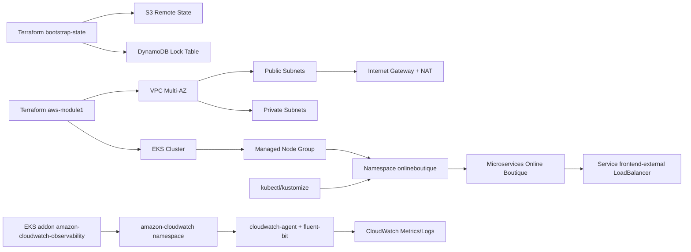
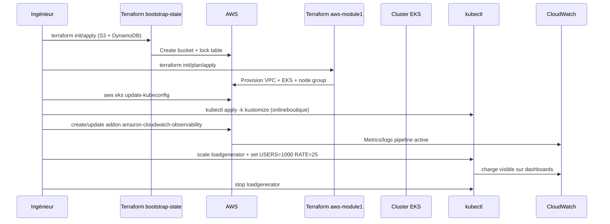

# Week 1 Livrable - Setup, Monitoring Basique CloudWatch et Test 1K

Source de référence: `BlackFriday_CahierDesCharges MT5.pdf`.

## 1. Contexte

Cette semaine 1 couvre la mise en place des fondations techniques:
- infrastructure AWS/EKS
- déploiement de l'application
- monitoring basique CloudWatch
- premier test de charge à 1 000 utilisateurs

Objectif principal:
- valider que la plateforme est déployable, observable, et stable sur une première charge.

## 2. Périmètre Week 1

Inclus:
- backend Terraform distant (S3 + DynamoDB)
- infrastructure AWS via Terraform (VPC + EKS)
- accès cluster via `kubectl`
- déploiement `onlineboutique`
- activation CloudWatch observability add-on
- exécution d'un test de charge 1K users

Non inclus (reporté semaine 2+):
- durcissement sécurité avancé
- tuning HPA complet
- campagne de charge progressive 5K/20K/50K/70K/90K
- Prometheus/Grafana en production project-ready

## 3. Architecture mise en place

## 4. Séquence d'exécution réalisée

## 5. Réalisations détaillées

### 5.1 Infrastructure et state management

- backend distant Terraform créé et utilisé
- module principal AWS initialisé sur backend S3/DynamoDB
- VPC/EKS déployés et cluster accessible

Résultat:
- environnement réutilisable, état Terraform partagé, verrouillage des applies actif

### 5.2 Déploiement applicatif

- namespace `onlineboutique` créé
- application déployée via `kustomize`
- service `frontend-external` exposé en `LoadBalancer`
- frontend accessible via DNS ELB

### 5.3 Monitoring basique CloudWatch

- add-on EKS `amazon-cloudwatch-observability` activé
- namespace `amazon-cloudwatch` actif
- pods `cloudwatch-agent` et `fluent-bit` en `Running`

Incident rencontré:
- `AccessDeniedException` sur `CreateLogStream` / `PutLogEvents`

Correction appliquée:
- policy IAM `CloudWatchAgentServerPolicy` attachée au rôle IAM des nodes EKS
- redémarrage des daemonsets CloudWatch

Résultat:
- erreur d'accès levée
- dashboard cluster CloudWatch alimenté

### 5.4 Test de charge 1K

Configuration loadgenerator:
- `USERS=1000`
- `RATE=25`
- `FRONTEND_ADDR=frontend:80`

Cycle exécuté:
- baseline
- charge
- arrêt loadgenerator
- vérifications post-test

## 6. Observations techniques (preuves)

État cluster/app observé:
- nodes Ready
- pods applicatifs majoritairement stables en `Running`
- service externe frontend disponible

Éléments notables observés:
- redémarrages sur `recommendationservice` pendant la charge (probes sensibles)
- quelques événements `Unhealthy` ponctuels (timeouts de probes)

CloudWatch dashboard (captures):
- `Ready Nodes = 3`, `NotReady Nodes = 0`
- CPU node modéré
- mémoire node modérée
- pics réseau/cpu corrélés à la fenêtre de charge

## 7. Écarts et points de vigilance

1. `metrics-server`/`kubectl top` pas immédiatement prêt pendant la fenêtre de test.
2. Probes frontend/recommendation à stabiliser pour les paliers de charge suivants.
3. Qualité de service sous charge à qualifier avec des seuils explicites (SLO/SLA) en semaine 2.

## 8. Conclusion Week 1

Statut global:
- **PASS (avec réserves techniques mineures)**

Pourquoi PASS:
- fondations infra validées
- application déployée et accessible
- monitoring CloudWatch basique fonctionnel
- premier test 1K exécuté de bout en bout

Réserves:
- stabilisation des probes
- finalisation métriques K8s locales (`metrics-server`) selon besoin outillage local

## 9. Actions prévues pour Week 2

1. Stabiliser les services sensibles sous charge (probes/timeouts).
2. Activer et valider autoscaling applicatif (HPA).
3. Renforcer sécurité (network policies, scans).
4. Exécuter les paliers de charge 5K, 20K, 50K avec collecte métriques standardisée.

## 10. Checklist de preuves à archiver

- capture `kubectl get nodes`
- capture `kubectl -n onlineboutique get pods`
- capture `kubectl -n onlineboutique get svc frontend-external`
- capture dashboard CloudWatch pendant charge
- extrait logs loadgenerator pendant test
- extrait events kube en fin de test

