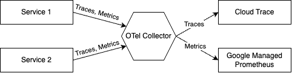

# Integrate Online Boutique with Google Cloud Operations

By default, [Google Cloud Operations](https://cloud.google.com/products/operations) instrumentation is **turned off** for Online Boutique deployments. This includes Monitoring (Stats), Tracing, and Profiler. This means that even if you're running this app on [GKE](https://cloud.google.com/kubernetes-engine), traces (for example) will not be exported to [Google Cloud Trace](https://cloud.google.com/trace).

If you want to re-enable Google Cloud Operations instrumentation, the easiest way is to enable the included kustomize module, which enables traces, metrics, and adds a deployment of the [Open Telemetry Collector](https://opentelemetry.io/docs/collector/) to gather the traces and metrics and forward them to the appropriate Google Cloud backend.

From the `kustomize/` folder at the root level of this repository, execute this command:

```bash
kustomize edit add component components/google-cloud-operations
```

This will update the `kustomize/kustomization.yaml` file which could be similar to:

```yaml
apiVersion: kustomize.config.k8s.io/v1beta1
kind: Kustomization
resources:
- base
components:
- components/google-cloud-operations
```

You can locally render these manifests by running `kubectl kustomize .` as well as deploying them by running `kubectl apply -k .`.

You will also need to make sure that you have the associated Google APIs enabled in your Google Cloud project:

```bash
PROJECT_ID=<your-gcp-project-id>
gcloud services enable \
    monitoring.googleapis.com \
    cloudtrace.googleapis.com \
    cloudprofiler.googleapis.com \
    --project ${PROJECT_ID}
```

In addition to that, you will need to grant the following IAM roles associated to your Google Service Account (GSA):

```bash
PROJECT_ID=<your-gcp-project-id>
GSA_NAME=<your-gsa>

gcloud projects add-iam-policy-binding ${PROJECT_ID} \
  --member "serviceAccount:${GSA_NAME}@${PROJECT_ID}.iam.gserviceaccount.com" \
  --role roles/cloudtrace.agent

gcloud projects add-iam-policy-binding ${PROJECT_ID} \
  --member "serviceAccount:${GSA_NAME}@${PROJECT_ID}.iam.gserviceaccount.com" \
  --role roles/monitoring.metricWriter
  
gcloud projects add-iam-policy-binding ${PROJECT_ID} \
  --member "serviceAccount:${GSA_NAME}@${PROJECT_ID}.iam.gserviceaccount.com" \
  --role roles/cloudprofiler.agent
```

**Note**
Currently only trace is supported.  Support for metrics, and more is coming soon.

## Changes

When enabling this kustomize module, most services will be patched with a configuration similar to the following:

```yaml
apiVersion: apps/v1
kind: Deployment
metadata:
  name: productcatalogservice
spec:
  template:
    spec:
      containers:
        - name: server
          env:
          - name: COLLECTOR_SERVICE_ADDR
            value: "opentelemetrycollector:4317"
          - name: ENABLE_STATS
            value: "1"
          - name: ENABLE_TRACING
            value: "1"
```

This patch sets environment variables to enable export of stats and tracing, as well as a variable to tell the service how to reach the new collector deployment.

## OpenTelemetry Collector

Currently, this component adds a single collector service which collects traces and metrics from individual services and forwards them to the appropriate Google Cloud backend.



If you wish to experiment with different backends, you can modify the appropriate lines in [otel-collector.yaml](otel-collector.yaml) to export traces or metrics to a different backend.  See the [OpenTelemetry docs](https://opentelemetry.io/docs/collector/configuration/) for more details.

## Workload Identity

If you are running this sample on GKE, your GKE cluster may be configured to use [Workload Identity](https://cloud.google.com/kubernetes-engine/docs/how-to/workload-identity) to manage access to Google Cloud APIs (like Cloud Trace). If this is the case, you may not see traces properly exported, or may see an error message like `failed to export to Google Cloud Trace: rpc error: code = PermissionDenied desc = The caller does not have permission` logged by your `opentelemetrycollector` Pod(s). In order to export traces with such a setup, you need to associate the Kubernetes [ServiceAccount](https://kubernetes.io/docs/tasks/configure-pod-container/configure-service-account/) (`default/default`) with your [default compute service account](https://cloud.google.com/compute/docs/access/service-accounts#default_service_account) on Google Cloud (or a custom Google Cloud service account you may create for this purpose).

* To get the email address associated with your Google service account, check in the IAM section of the Cloud Console.  Or run the following command in your terminal:

```bash
gcloud iam service-accounts list
```

* Then, allow the Kubernetes service account to act as your Google service account with the following command (using your own `PROJECT_ID` and the `GSA_EMAIL` you found in the previous step):

```bash
gcloud iam service-accounts add-iam-policy-binding ${GSA_EMAIL} \
  --role roles/iam.workloadIdentityUser \
  --member "serviceAccount:${PROJECT_ID}.svc.id.goog[default/default]"
```

* Annotate your Kubernetes service account (`default/default` for the `default` namespace) to use the Google IAM service account:

```bash
kubectl annotate serviceaccount default \
  iam.gke.io/gcp-service-account=${GSA_EMAIL}
```

* Finally, restart your `opentelemetrycollector` deployment to reflect the new settings:

```bash
kubectl rollout restart deployment opentelemetrycollector
```

When the new Pod rolls out, you should start to see traces appear in the cloud console.
