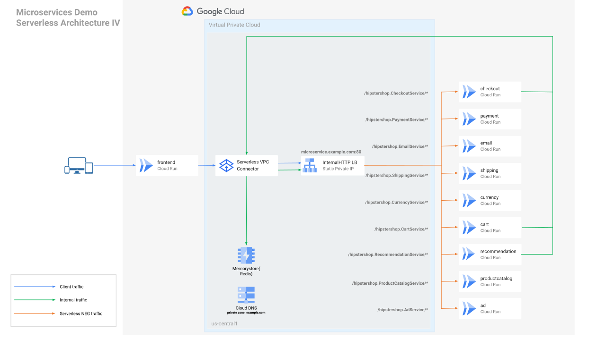

## Overview
This document describes building and deploying the microservices demo application(`Online Boutique`) to Cloud Run.

Some objectives:

- Minimize code changes.
- Ensure the internal microservices are private and keep the network traffic inside the Google network (serverless VPC connectors will be used).
- Redis cache will be deployed to [Memorystore(Redis)](https://cloud.google.com/memorystore/docs/redis).
- Use Infrastructure-as-code([Pulumi](https://www.pulumi.com/)) to deploy the solution.

## Architecture after deployment



## Clone the repository

```
git clone https://github.com/GoogleCloudPlatform/microservices-demo.git
```

## Install pulumi

```
cd microservices-demo/serverless/pulumi
npm install
curl -fsSL https://get.pulumi.com | sh
export PATH=$PATH:$HOME/.pulumi/bin
```

## Config project

```
export PROJECT_ID=<YOUR GCP PROJECT ID>
gcloud config set project $PROJECT_ID
gcloud auth application-default login
gcloud auth configure-docker
```

## Create a bucket as a Pulumi [backend](https://www.pulumi.com/docs/intro/concepts/state/#logging-into-the-google-cloud-storage-backend)

```
gsutil mb gs://pulumi-${PROJECT_ID}

pulumi login gs://pulumi-${PROJECT_ID}
```

## Create a new dev stack
```
pulumi stack init dev

pulumi config set gcp:project $PROJECT_ID
```
You can press `return` to skip the passphrase.

## Create the stack
```
pulumi up -y
```

By default, the service deployments will use the container images listed in the [release/kubernetes-manifests.yaml](../../release/kubernetes-manifests.yaml) file.

If you want to build the container images from the source code, you can set the flag `build_image_from_src` to true using the following command:

```
pulumi config set build_image_from_src true
```

__Note:__ However, this step will __NOT__ work in CloudShell since CloudShell doesn't have sufficient disk space to build all the container images.

## Clean up

If you don't want to delete the whole project, run the following command to delete the resources:

```
pulumi destroy -y
```